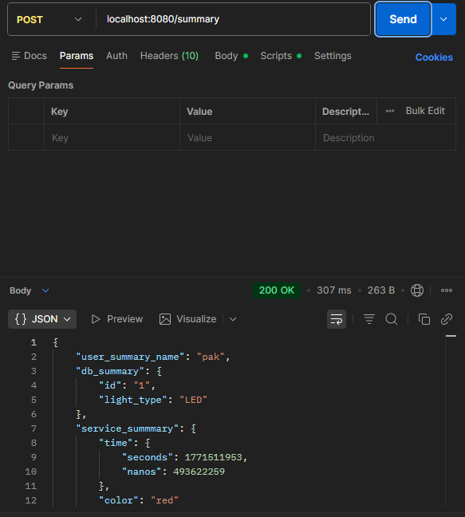

# summary-aggregation service
## Описание
сервис представляет собой сервер который отдает информацию по пользователю из нескольких сервисов (аггрегирует сервисы) по username из запроса. реализовано с помощью postgres как основной пример и кэш с redis. пример запроса:

реализована а-ля liveness probe которая проверяет живоспособность aggregator service через get запрос:
результаты при выкл сервисах:

## to gen .pb files:
docker-compose --profile tools run --rm protobuf_gen